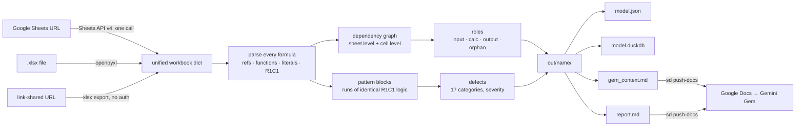

# sheets_decomposer

Deterministic structural extraction of a spreadsheet (Google Sheets or `.xlsx`) into JSON, a DuckDB database, a Markdown report, and a compact context file for an LLM.

One working rule: **scripts do the extraction and the deterministic checks; the model only ever sees structured output; a human reviews anything that becomes a source of truth.** The tool exists so that reverse-engineering an undocumented workbook starts from facts, not from a chat window.

## What you get

For each workbook, `out/<name>/` holds four files. Two are for the Gem; two are for the deeper pass a human does with an AI assistant at the keyboard.

| File | Audience | What it is |
|---|---|---|
| `report.md` | human first, Gem second | inventory, mermaid dependency diagram, formula patterns, findings by severity, questions for the model owner. Read §1–2 before opening the workbook |
| `gem_context.md` | the Gem | structure-only context: sheets, order, edges, named ranges, formula blocks, labels, findings. No data rows unless you ask for them |
| `model.duckdb` | human + AI assistant | 18 tables and 12 `vw_` views over every cell, formula, reference edge, pattern, role and finding. The place to ask questions the report did not anticipate |
| `model.json` | AI assistant + scripts | the whole extraction and analysis as one document: every populated cell with formula, value, format, note and validation, plus named ranges, protections, merges, charts, and the full analysis (edges, patterns, roles, defects, graph). The input for any further script or for a coding assistant working the problem |

### Working the DuckDB file with an assistant

`model.duckdb` is where the analysis goes past the report. Open it with `./sd query`, the DuckDB CLI, DBeaver, or DataGrip, or hand it to a coding assistant (Claude Code, Cursor, Codex) that can run SQL. Questions the views answer directly:

| Question | Query |
|---|---|
| What is in this workbook, and what role does each tab play? | `select * from vw_sheet_summary` |
| What depends on what? | `select * from vw_sheet_dependency` |
| Where does data enter by hand? | `select sheet, count(*) from vw_inputs group by 1` |
| What are the terminal outputs? | `select * from vw_outputs` |
| Which cells read this one cell? (change target) | `select from_sheet, from_a1 from edges where to_sheet='Assumptions' and to_range='B4'` |
| Every distinct piece of logic, one row per block | `select * from vw_formula_patterns` |
| Which blocks break their own pattern? | `select * from vw_inconsistent_patterns` |
| The defect list, worst first | `select * from vw_defects` |
| External spreadsheets this one depends on | `select * from vw_external_refs` |
| The author's function vocabulary | `select * from vw_functions` |

`sql/practice_queries.sql` runs the ten in sequence. The base tables (`cells`, `formulas`, `edges`, `cell_roles`, `patterns`, `defects`, `named_ranges`, `validations`, `protected_ranges`, `charts`, `merges`, `sheets`, `workbook`) are there for anything the views do not cover. Close any GUI connection before re-running `ingest` to the same name; DuckDB holds an exclusive lock.

### Working the JSON with an assistant

`model.json` is the same content as the database, as one document: `workbook` (source, properties, Drive metadata, named ranges, sheets with their cells) and `analysis` (formulas with parsed refs and R1C1, edges, sheet_edges, cell_roles, sheet_summary, patterns, defects, graph, functions, importranges). It is the right input when the next step is code: a script that rewrites a block, a diff between two ingests of the same workbook, or a coding assistant that needs the full picture in one file. It is large for a chat window; point an assistant at the file rather than pasting it.

## Process flow



What the analyzer derives:

| Output | Meaning |
|---|---|
| sheet roles | `input/raw`, `config`, `calc`, `output`, `orphan`, from formula ratio and in/out degree |
| edges, sheet_edges | every reference a formula makes, aggregated to a sheet dependency graph and a calculation order |
| patterns | contiguous runs of formulas collapsed to one R1C1 signature; each cell is assigned to the axis (row or column) where it sits in the stronger run, so month-across and record-down models both collapse cleanly |
| cell roles | `input` (a literal that formulas read), `calc`, `output` (a formula nothing reads), `static`, `label` |
| defects | `hardcoded_in_formula_range`, `inconsistent_formula`, `magic_number`, `broken_reference`, `error_value`, `text_number`, `external_dependency`, `dynamic_reference`, `volatile_function`, `hidden_sheet`, `hidden_rows_cols`, `orphan_sheet`, `circular_reference`, `missing_checks`, `unused_named_range`, `whole_column_reference`, `complex_formula` |

## Setup

Python 3.11+. Either a conda env or a venv:

```bash
# conda
conda create -n sheets python=3.11 -y && conda activate sheets
# or venv
python3.11 -m venv .venv && source .venv/bin/activate

pip install -r requirements.txt
./sd --help
```

`./sd` picks its interpreter in this order: `SD_PYTHON` from `.env`, an active `$CONDA_PREFIX`, `.venv`, a `sheets` env under `~/anaconda3` or `~/miniconda3`, then whatever `python` is on the path.

Google credentials are needed only for the Sheets URL path and for pushing to Docs. `docs/SETUP_GOOGLE_API.md` walks the console clicks (about 15 minutes, once). The `.xlsx` path and the link-shared export path need nothing.

## Use

```bash
./sd sample                                          # seeded practice workbook + answer key in out/
./sd ingest out/sample_calls_chats.xlsx              # a file
./sd ingest "https://docs.google.com/spreadsheets/d/<ID>/edit"                 # OAuth (default)
./sd ingest "https://docs.google.com/spreadsheets/d/<ID>/edit" --auth service  # service account
./sd ingest "https://docs.google.com/spreadsheets/d/<ID>/edit" --auth export   # link-shared, no creds
./sd ingest <src> --name mymodel                     # choose the output folder name
./sd ingest <src> --include-values                   # add sample rows to gem_context.md (practice data only)
./sd ingest <src> --push-docs                        # also overwrite the Gem's knowledge Docs

./sd query out/mymodel/model.duckdb "select * from vw_defects where severity='high'"
./sd query out/mymodel/model.duckdb -f sql/practice_queries.sql
./sd tables out/mymodel/model.duckdb
./sd push-docs out/mymodel                           # refresh the Docs from what is on disk
```

Useful views: `vw_sheet_summary`, `vw_sheet_dependency`, `vw_defects`, `vw_defect_counts`, `vw_formula_patterns`, `vw_inconsistent_patterns`, `vw_inputs`, `vw_outputs`, `vw_cell_dependencies`, `vw_external_refs`, `vw_functions`. `sql/practice_queries.sql` is ten questions to ask any new workbook.

## The Gem

`docs/GEM_INSTRUCTIONS.md` has the Gem's system instructions, a 24-question acceptance test, and a scoring table. Short version:

1. Create a Gem, paste the instructions.
2. Create two empty Google Docs, put their URLs in `.env` as `SD_GEM_CONTEXT_DOC` and `SD_REPORT_DOC`, enable the Google Docs API in your Cloud project, and run `./sd push-docs out/<name>`.
3. Attach the two Docs as the Gem's Knowledge.
4. After every push, remove and re-attach the Docs in the Gem editor. Gemini does not re-read a linked Doc on its own.

On the seeded sample the Gem answers 24 of 24 with citations, including refusing the four trap questions.

## The method this supports

1. Confirm the question before touching a cell.
2. Inventory: what is here, where data enters, what depends on what. ← `report.md` §1–2
3. Read the logic as patterns, not cells. ← §3, `vw_formula_patterns`
4. List defects in the owner's vocabulary, with severity and location. ← §7, `vw_defects`
5. Build alongside, never modify in place; reconcile the two.
6. Write it up: assumptions, findings, changes, checks, limits, next. ← §7–8 are the raw material

## Known gaps

- Transposed references (down a column reading across a row) show as single formulas, not a block.
- A formula that is consistent but computes the wrong thing looks clean. Read the row labels.
- Staleness is a label, not a finding: a date typed in a cell is data.
- Charts come through on the Sheets API path only; openpyxl drops them.
- Values need a real calculation engine: an `.xlsx` written by a script has no cached values until Excel or Sheets opens and saves it. The Sheets API always has them.
- Gemini Gems do not re-read a linked Google Doc on their own. After `push-docs`, remove and re-attach the Docs.

## License

MIT.
